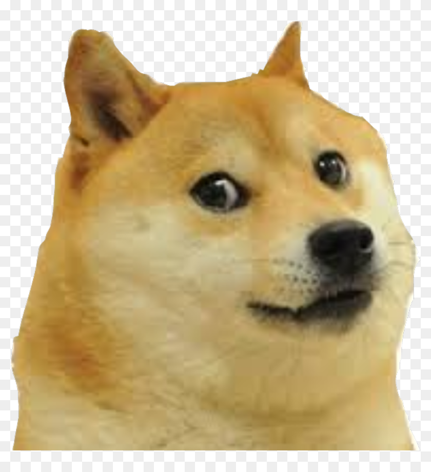
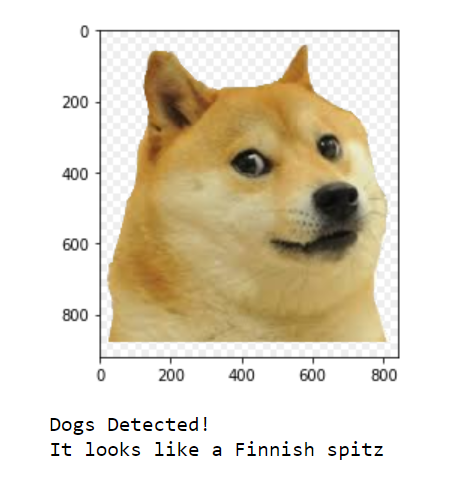

# Udacity: Deep Learning Nanodegree
## CNN Project: Dog Breed Classifier
### Project Overview
Welcome to the Convolutional Neural Networks (CNN) project in the AI Nanodegree! In this project, you will learn how to build a pipeline that can be used within a web or mobile app to process real-world, user-supplied images. Given an image of a dog, your algorithm will identify an estimate of the canine’s breed. If supplied an image of a human, the code will identify the resembling dog breed.

Sample Input:

Output:

Along with exploring state-of-the-art CNN models for classification and localization, you will make important design decisions about the user experience for your app. Our goal is that by completing this lab, you understand the challenges involved in piecing together a series of models designed to perform various tasks in a data processing pipeline. Each model has its strengths and weaknesses, and engineering a real-world application often involves solving many problems without a perfect answer. Your imperfect solution will nonetheless create a fun user experience!

### Import Datasets
* Download the [dog dataset](https://s3-us-west-1.amazonaws.com/udacity-aind/dog-project/dogImages.zip).  Unzip the folder and place it in this project's home directory, at the location `/dog_images`. 

* Download the [human dataset](https://s3-us-west-1.amazonaws.com/udacity-aind/dog-project/lfw.zip).  Unzip the folder and place it in the home directory, at location `/lfw`.  

*Note: If you are using a Windows machine, you are encouraged to use [7zip](http://www.7-zip.org/) to extract the folder.*

In the code cell below, we save the file paths for both the human (LFW) dataset and dog dataset in the numpy arrays `human_files` and `dog_files`.

Transfer Learnings
Used VGG16 for transfer learnings

Accuracy has been achieved up to 80% with 10 epochs

